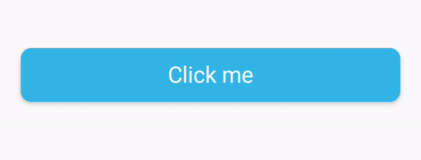

# ProgressButtonCard
Progress Button Based on CardView



### Install (Gradle)
Add it in your root build.gradle at the end of repositories:
```
allprojects {
	repositories {
		...
		maven { url 'https://jitpack.io' }
	}
}
```
Step 2. Add the dependency
```
dependencies {
	implementation 'com.github.giorgi-abashidze:ProgressButtonCard:1.3'
}
```

### Properties:
"Button" is based on a CardView, you can use every property that
CardView have, for example **cardElevation**, **cardBackgroundColor**.

* **PBC_Text** provides the text of the button
* **PBC_TextStyle** provides the style of the text. possible values is: **bold, normal, italic** default is normal
* **PBC_TextColor** provides te color of the button text **! This property working only with hex color strings like: #ffffff**
* **PBC_Radius** provides corner radius of the button

### Button Gradient specific properties:
* **PBC_Gradient_Orientation** provides orientation of a gradient. pssoble values is: **top_bottom**, **left_right**, **bottomLeft_topRight**, **topLeft_bottomRight**
* **PBC_StartColor** provides the start color of a gradient **! This property working only with hex color strings like: #ffffff**
* **PBC_EndColor** provides the end color of a gradient **! This property working only with hex color strings like: #ffffff**

#### Text size is depending on button height you dont need to set the text size manually.

### Example in XML:
#### Default Button:
```
<ga.progress_button_card.Default
        app:cardBackgroundColor="@color/colorPrimary"
        android:id="@+id/progress_button_card"
        app:cardElevation="3dp"
        android:layout_margin="10dp"
        android:layout_width="match_parent"
        android:layout_height="50dp"
        app:PBC_Text="Click me"
        app:PBC_Radius="10dp"
        app:PBC_TextColor="#ffffff"
        />
```
#### Gradient Button:
```
<ga.progress_button_card.Gradient
        android:id="@+id/progress_button_card_gradient"
        app:cardElevation="3dp"
        android:layout_margin="10dp"
        android:layout_width="match_parent"
        android:layout_height="50dp"
        app:PBC_StartColor="#CD3333"
        app:PBC_EndColor="#FA7474"
        app:PBC_Text="Click me"
        app:PBC_Radius="10dp"
        app:PBC_TextColor="#ffffff"
        app:PBC_Gradient_Orientation="top_bottom"
        />
```

### You can switch loading and not loading modes with functions: loading() and notLoading()
### Example:
```
ga.progress_button_card.Default button;

    @Override
    protected void onCreate(Bundle savedInstanceState) {
        super.onCreate(savedInstanceState);
        setContentView(R.layout.activity_main);

        button = findViewById(R.id.progress_button_card);

        button.setOnClickListener(new View.OnClickListener() {
            @Override
            public void onClick(View v) {

                button.loading();

                final Handler handler = new Handler();

                handler.postDelayed(new Runnable() {
                    @Override
                    public void run() {
                        button.notLoading();
                    }
                }, 5000);
            }
        });


    }
```

